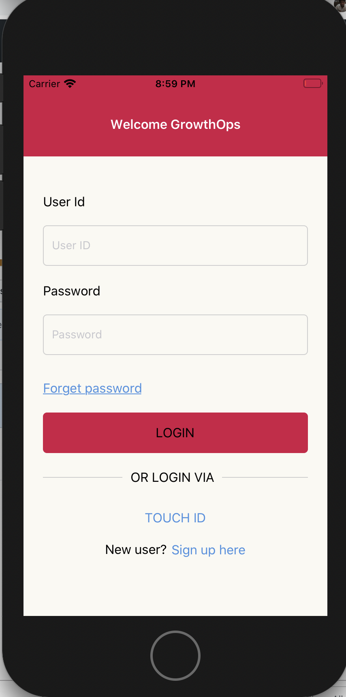
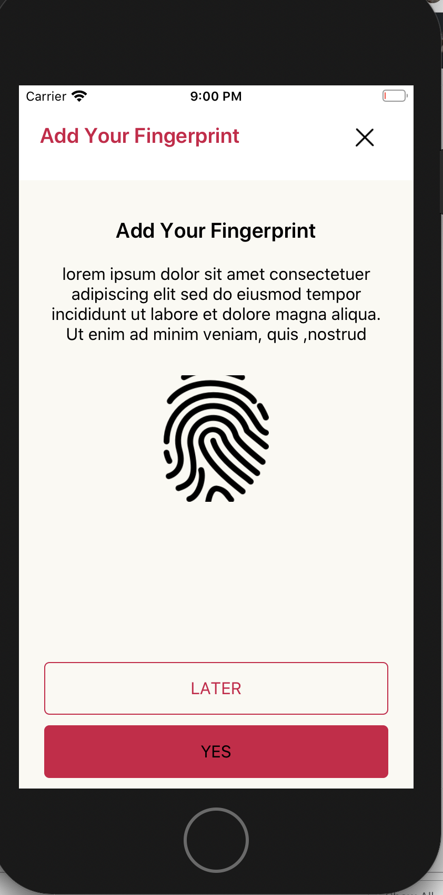
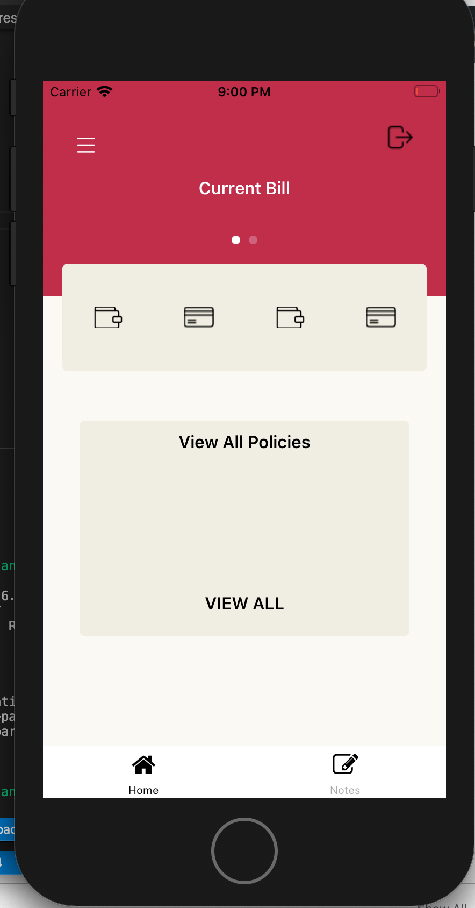
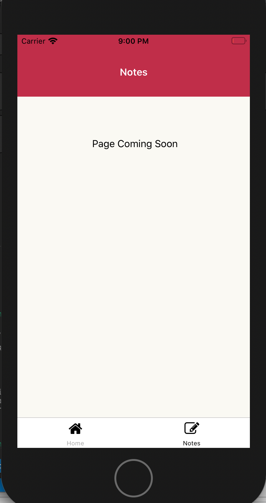

# GrowthOps
GrowthOps App

Steps to compile the Application

 1) Clone the Git repository to specific location.
 2) Run npm I command for install node modules.
 3) Navigate to IOS Floder (cd ios) and run pod install.
 4) Build and Run

